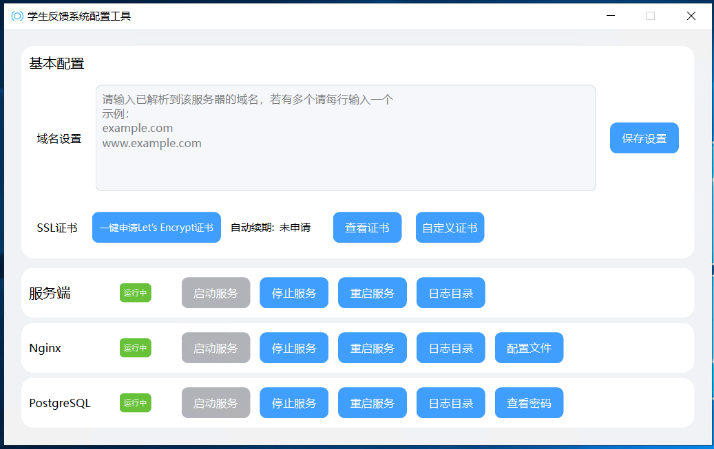

# 一键部署详细操作说明

## 目录

- <a href="#一准备部署">准备部署</a>
  - <a href="#1服务器">服务器</a>
  - <a href="#2网站域名">网站域名</a>
  - <a href="#3域名备案">域名备案</a>
- <a href="#二开始部署">开始部署</a>
  - <a href="#1连接服务器">连接服务器</a>
  - <a href="#2下载并使用一键部署">下载并使用一键部署</a>
  - <a href="#3基本配置">基本配置</a>
- <a href="#三设置网站">设置网站</a>
  - <a href="#1首次登录重置密码">首次登录重置密码</a>
  - <a href="#2完成网站设置">完成网站设置</a>
  - <a href="#3添加“入站考试”题目">添加“入站考试”题目</a>
- <a href="#四后台账号列表">后台账号列表</a>
- <a href="#五联系我以获得帮助">联系我以获得帮助</a>

## 一、准备部署

#### 1、服务器

 你可以在[阿里云](https://www.aliyun.com/)、[腾讯云](https://cloud.tencent.com/)、[京东云](https://www.jdcloud.com/)等云服务器提供商购买并初始化用于部署网站的服务器，或者在淘宝等电商平台寻找代理商购买（可能会便宜一些），当然也可以使用物理服务器，不过这并不推荐，这会大大增加维护成本。

 服务器需要满足以下要求：

- 推荐的最低配置为2G内存和2核处理器
- 运行操作系统为Windows Server 2012及以上（推荐Windows Server 2016以上）
- 未部署过任何运行环境（初始化服务器时选择纯净系统）
- 可开放80和443端口（部分服务器厂商需要手动设置规则）

 如果你完全不了解以上相关内容，建议到电商平台寻找热心商家为你解答或选择，并让其协助完成操作系统及端口配置，甚至可以尝试将本说明发给商家让其完成部署。

#### 2、网站域名

 域名通常就是网站的网址，域名也需要注册和购买，你也可以选择在云服务器提供商或电商平台购买。注册后需要将域名解析至服务器的IP地址，通常将主域名和www子域名解析至服务器，列如`example.com`、`www.example.com` (假设`example.com`是你的域名)

 如果你还是不了解，那仍然可以到电商平台寻找热心商家购买并让其协助完成域名解析。

 域名不是必须的，你也可以直接用服务器的IP地址访问你的网站，不过这可能会不太好记。

#### 3、域名备案

 如果你选择大陆外服务器（例如香港云服务器），或不使用域名访问网站（即通过IP访问），那么就可以直接跳过这一步。

 域名备案通常是在云服务器厂商进行的（物理服务器需要自行到工信部备案），可以参考各厂商的备案说明。若服务器在电商平台购买，可直接询问商家以获得备案说明。在云服务器厂商备案通常需要备案授权码，备案授权码需要购买服务器才可获得，因此请先完成前两步再进行备案。

## 二、开始部署

#### 1、连接服务器

 在任意windows电脑任务栏中搜索“远程桌面连接”（win10以下可在开始菜单>附件目录中找到），输入服务器IP地址，点“连接”后输入用户名（通常为Administrator）和密码（初始化服务器时设置的）并点“确定”，等待进入服务器桌面即可。

 你也可以使用其他方式连接服务器，不过必须要进入桌面，无法使用命令行部署。

#### 2、下载并使用一键部署

 [点击此处](https://github.com/jin-ct/stufbsys/releases)下载最新的一键部署工具，你可以直接在服务器中下载（不推荐，因为通常要先安装一个浏览器才可流畅下载），或在本地电脑下载后复制到远程服务器（使用“远程桌面连接”时可以在本地电脑文件资源管理器复制文件然后在远程服务器粘贴），完成后双击即可运行。运行后点击“一键部署”并等待完成，最后完成时点击弹出消息框的“OK”按钮即可完成基本部署，此时会自动启动配置工具，请勿关闭配置工具窗口，否则可能会部署失败。运行结果如下：

 需要注意的是，配置工具进入主页后请等待一段时间，直至下方三个服务的状态都为绿色的“运行中”，如果长时间等待后仍然存在部分服务的状态为红色的“已暂停”，请尝试点击该服务一栏的“启动服务”按钮，如果无法启动或“启动服务”按钮长时间为灰色，可以<a href="#五联系我以获得帮助">联系</a>我以获得帮助。

#### 3、基本配置

 以上步骤都已完成且无任何错误后，即可在配置工具中根据提示输入域名并保存（没有域名则填写IP地址）。保存后请在任意设备中输入域名（或IP地址）以测试网站是否能正常访问。如果访问成功，那恭喜你完成了网站的部署工作。若不能正常访问，可请求服务器厂商客服或电商平台商家帮助，或<a href="#五联系我以获得帮助">联系</a>我以获得帮助。

 为了让网站更安全，通常建议申请SSL证书以让数据加密传输（部分浏览器会将没有SSL证书的网站标记为“不安全”），你可直接点击配件工具的“一键申请Let's Encrypt证书”按钮以获得免费证书并自动安装，如果申请失败建议再次尝试；Let's Encrypt是一个免费SSL证书颁发机构，其颁发的证书有效期为90天，配置工具已开启自动续期（通常在申请后的60至80天内自动续期），你可在邻近到期时打开配置工具查看是否已自动续期，如果没有自动续期可以再次点击申请。

 完成配置后可关闭配置工具，在下次需要时再次在桌面双击图标打开即可。

 如果需要暂时关闭网站，直接将配置工具中的三个服务停止即可，启用网站同理。

## 三、设置网站

 访问`www.example.com/admin`（假设你的域名是`example.com`）进入网站管理后台，登录admin账号（<a href="#四后台账号列表">后台账号列表</a>），点击左侧导航栏的平台设置>网站设置，进入网站设置页面，如图：

#### 1、首次登录重置密码

 首次登录后台建议立即设置新密码以保证管理员账号的安全，在“网站设置”右下角的“账号设置”中选择需要修改的账号并输入新密码，点击“保存设置”即可，每个账号设置后都需要保存一遍。所有管理员账号的密码均只能在“最高管理员”账号中重置。请务必重置每一个管理员账号的密码以保证安全。

#### 2、完成网站设置

 根据页面提示及实际需求可完成大部分设置，这里着重介绍“AI调用设置”

 本系统的所有AI功能均通过调用AI模型平台提供API（应用程序编程接口）实现，AI模型的API调用一般都是要收取一定资费的（但对于本系统的AI使用量来说收费应该是很少的，通常每月不超过10元，甚至少于1元）。

 下面列举了国内的一些AI模型及其相关信息：

|   名称   |                    官网链接                     |               API链接（可直接填入后台设置中）                |                   AI模型名称（可直接填入）                   |                         密钥获取方式                         |
| :------: | :---------------------------------------------: | :----------------------------------------------------------: | :----------------------------------------------------------: | :----------------------------------------------------------: |
| DeepSeek |   [点击访问](https://platform.deepseek.com/)    |         `https://api.deepseek.com/chat/completions`          | deepseek-chat或[查看更多](https://api-docs.deepseek.com/zh-cn/quick_start/pricing) |      [点击查看](https://platform.deepseek.com/api_keys)      |
| 通义千问 | [点击访问](https://bailian.console.aliyun.com/) | `https://dashscope.aliyuncs.com/compatible-mode/v1/chat/completions` | qwen-max或[查看更多](https://help.aliyun.com/zh/model-studio/models?spm=a2ty02.30268951.d_model-market.1.c49774a1HGGywA#1dec1fd1d9sub) | [点击查看](https://bailian.console.aliyun.com/?tab=api#/api) |
| 智谱清言 |      [点击访问](https://open.bigmodel.cn/)      |   `https://open.bigmodel.cn/api/paas/v4/chat/completions`    | GLM-4.5或[查看更多](https://docs.bigmodel.cn/cn/guide/models/text/glm-4.5) | [点击查看](https://docs.bigmodel.cn/cn/guide/start/quick-start) |

 根据表格信息获取需要填写的内容并填入后台设置中，先点击“测试调用”，测试成功后再保存。若测试不成功，请检查API链接、AI模型名称、密钥中是否存在空格，若存在请删除。如果多次测试仍然不成功，可更换模型再次重试。

#### 3、添加“入站考试”题目

 在平台设置>入站考试题库中点击右上角“添加题目”按钮，按照提示完成题目添加。

## 四、后台账号列表

| 编号 |    名称    |      账号       |       默认密码        |
| :--: | :--------: | :-------------: | :-------------------: |
|  1   | 最高管理员 |      admin      |    stufbsys_admin     |
|  2   | 基本管理员 |    baseadmin    |  stufbsys_baseadmin   |
|  3   | 建议管理员 | suggestionadmin |   stufbsys_sugadmin   |
|  4   | 饭堂管理员 |  canteenadmin   | stufbsys_canteenadmin |

## 五、联系我以获得帮助

优先处理校方的请求，如果为校方请备注学校信息

1. 邮箱：<jin@chuangtian.ltd> （推荐）
2. 微信：chuangtian179
